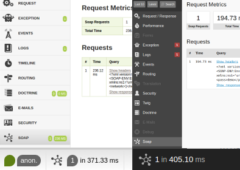

SoapBundle [](https://travis-ci.org/nfqde/soap-bundle)
==========

SoapBundle provides functionality for PHP SoapClient to be traceable by Symfony WebProfiler.



## Features

* Requests are being logged in WebProfiler
* Event is being dispatched after SoapRequest

## Installation

1. Add this bundle to your project as composer dependency
    ```bash
    composer require nfqde/soap-bundle
    ```

1. Add this bundle in application kernel
    ```php
    // app/AppKernel.php
    public function registerBundles()
    {
        // ...
        $bundles[] = new Nfq\Bundle\SoapBundle\NfqSoapBundle();

        return $bundles;
    }
    ```

## Usage

Instead of creating SoapClient like `new \SoapClient($wsdl, $optionalOptions)`
you SHOULD create it via `$container->get('nfq_soap.factory')->create($wsdl, $optionalOptions)`
which returns an instance of SoapClient.

```php
// Old way
$oldSoapClient = new \SoapClient($wsdl);

// New way
$client = $container->get('nfq_soap.factory')->create($wsdl);
```

```yml
# Old Way
services:
    class: SoapClient
    arguments: ["%wsdl_url%"]

# New Way
services:
    class: SoapClient
    factory: ["@nfq_soap.factory", create]
    arguments: ["%wsdl_url%"]
```

## License

SoapBundle is licensed under the MIT License - see the `LICENSE` file for details
